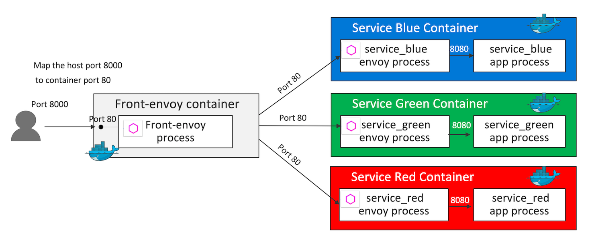

# Envoy Proxy Demos
Set of demos to demonstrate [Envoy Proxy](https://www.envoyproxy.io/) features

This project is a fork of the [Envoy's example demo sets](https://github.com/envoyproxy/envoy/tree/master/examples)

## Pre-requisites
- `docker daemon`: You need to have access to a docker daemon to run the demos
- `cURL` : You need cURL to test the demos

## Table of Content
- [HTTP Routing: Simple Match Routing](httproute-simple-match)
- [HTTP Routing: Routing based on Header Condition](httproute-header-match)
- [HTTP Routing: Blue Green Traffic Splitting](httproute-blue-green)
- [Fault Injection](fault-injection)
- [Circuit Breaker](circuit-breaker)
- [Timeouts and Retries (+ Fault Injections)](timeouts-retries)
- [Jaeger Tracing](jaeger-tracing)
- [Zipkin Tracing](zipkin-tracing)

## Demo versions and supported envoy versions
- v2.0.0 (WIP):  envoy api V2 based demo apps
- [v1.0.0](https://github.com/yokawasa/envoy-proxy-demos/releases/tag/v1.0.0): envoy api v1 based demo apps

## Contributing

Bug reports and pull requests are welcome on GitHub at https://github.com/yokawasa/envoy-proxy-demos
