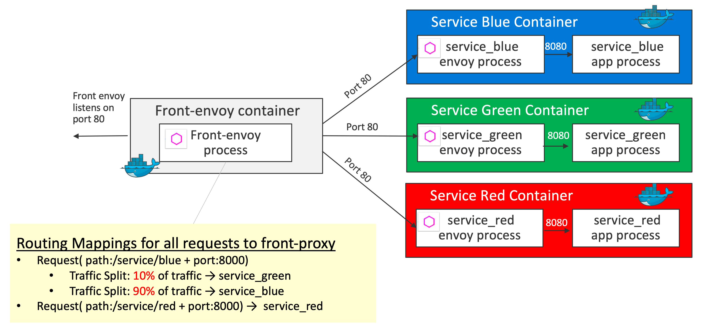

# HTTP Routing: Blue Green Traffic Splitting

## Demo Overview



Key definition 1 - `virtual_hosts` in [front-envoy.yaml](front-envoy.yaml)
```yaml
    virtual_hosts:
    - name: backend
        domains:
        - "*"
        routes:
        - match:
            prefix: "/service/blue"
        route:
            weighted_clusters:
            clusters:
            - name: service_green
                weight: 10
            - name: service_blue
                weight: 90
        - match:
            prefix: "/service/red"
        route:
            cluster: service_red
```

Key definition 2 - `clusters` in [front-envoy.yaml](front-envoy.yaml)
```yaml
  clusters:
  - name: service_blue
    connect_timeout: 0.25s
    type: strict_dns
    lb_policy: round_robin
    http2_protocol_options: {}
    hosts:
    - socket_address:
        address: service_blue
        port_value: 80
  - name: service_green
    connect_timeout: 0.25s
    type: strict_dns
    lb_policy: round_robin
    http2_protocol_options: {}
    hosts:
    - socket_address:
        address: service_green
        port_value: 80
  - name: service_red
    connect_timeout: 0.25s
    type: strict_dns
    lb_policy: round_robin
    http2_protocol_options: {}
    hosts:
    - socket_address:
        address: service_red
        port_value: 80
```

## Getting Started
```sh
git clone https://github.com/yokawasa/envoy-proxy-demos.git
cd envoy-proxy-demos/httproute-blue-green
```

> [NOTICE] Before you run this demo, make sure that all demo containers in previous demo are stopped!

## Run the Demo
```sh
# Build and Run containers using docker-compose
$ docker-compose up --build -d

# check all services are up
$ docker-compose ps --service

front-envoy
service_blue
service_green
service_red

# List containers
$ docker-compose ps

                Name                              Command               State                            Ports
---------------------------------------------------------------------------------------------------------------------------------------
httproute-blue-green_front-envoy_1     /usr/bin/dumb-init -- /bin ...   Up      10000/tcp, 0.0.0.0:8000->80/tcp, 0.0.0.0:8001->8001/tcp
httproute-blue-green_service_blue_1    /bin/sh -c /usr/local/bin/ ...   Up      10000/tcp, 80/tcp
httproute-blue-green_service_green_1   /bin/sh -c /usr/local/bin/ ...   Up      10000/tcp, 80/tcp
httproute-blue-green_service_red_1     /bin/sh -c /usr/local/bin/ ...   Up      10000/tcp, 80/tcp
```

Access each services
```sh
# Access serivce_blue and check if blue background page is displayed with 90% possibility and green background page is displayed with 10% possibility
$ curl -s http://localhost:8000/service/blue

# Access serivce_red and check if red background page is displayed
curl -s http://localhost:8000/service/red
```

## Stop & Cleanup
```sh
$ docker-compose down --remove-orphans --rmi all
```