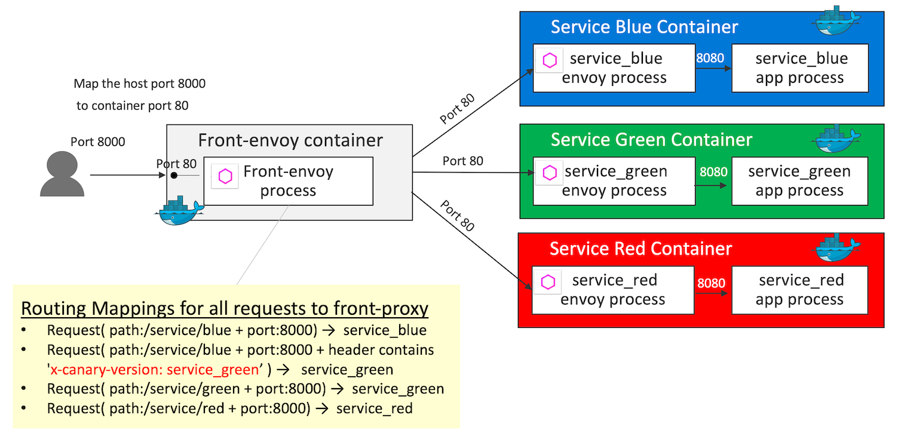

# HTTP Routing: Routing based on Header Condition

## Demo Overview



Key definition 1 - `virtual_hosts` in [front-envoy.yaml](front-envoy.yaml)
```yaml
    virtual_hosts:
    - name: backend
        domains:
        - "*"
        routes:
        - match:
            prefix: "/service/blue"
            headers:
            - name: "x-canary-version"
                exact_match: "service_green"
        route:
            cluster: service_green
        - match:
            prefix: "/service/blue"
        route:
            cluster: service_blue
        - match:
            prefix: "/service/red"
        route:
            cluster: service_red
```

Key definition 2 - `clusters` in [front-envoy.yaml](front-envoy.yaml)
```yaml
  clusters:
  - name: service_blue
    connect_timeout: 0.25s
    type: strict_dns
    lb_policy: round_robin
    http2_protocol_options: {}
    load_assignment:
      cluster_name: service_blue
      endpoints:
      - lb_endpoints:
        - endpoint:
            address:
              socket_address:
                address: service_blue
                port_value: 80
  - name: service_green
    connect_timeout: 0.25s
    type: strict_dns
    lb_policy: round_robin
    http2_protocol_options: {}
    load_assignment:
      cluster_name: service_green
      endpoints:
      - lb_endpoints:
        - endpoint:
            address:
              socket_address:
                address: service_green
                port_value: 80
  - name: service_red
    connect_timeout: 0.25s
    type: strict_dns
    lb_policy: round_robin
    http2_protocol_options: {}
    load_assignment:
      cluster_name: service_red
      endpoints:
      - lb_endpoints:
        - endpoint:
            address:
              socket_address:
                address: service_red
                port_value: 80
```

## Getting Started
```sh
git clone https://github.com/yokawasa/envoy-proxy-demos.git
cd envoy-proxy-demos/httproute-header-match
```

> [NOTICE] Before you run this demo, make sure that all demo containers in previous demo are stopped!

## Run the Demo

### Build and Run containers

```sh
docker-compose up --build -d

# check all services are up
docker-compose ps --service

front-envoy
service_blue
service_green
service_red

# List containers
docker-compose ps

                 Name                               Command               State                            Ports
-----------------------------------------------------------------------------------------------------------------------------------------
httproute-header-match_front-envoy_1     /docker-entrypoint.sh /bin ...   Up      10000/tcp, 0.0.0.0:8000->8000/tcp, 0.0.0.0:8001->8001/tcp
httproute-header-match_service_blue_1    /bin/sh -c /usr/local/bin/ ...   Up      10000/tcp, 80/tcp                                        
httproute-header-match_service_green_1   /bin/sh -c /usr/local/bin/ ...   Up      10000/tcp, 80/tcp                                        
httproute-header-match_service_red_1     /bin/sh -c /usr/local/bin/ ...   Up      10000/tcp, 80/tcp   
```

### Access each services

Access serivce_blue and check if blue background page is displayed

```sh
curl -s -v http://localhost:8000/service/blue
```

Access serivce_blue with Headers `x-canary-version: service_green`and check if green background page (service_green) is displayed

```sh
curl -s -H 'x-canary-version: service_green' http://localhost:8000/service/blue
```

Access serivce_red and check if red background page is displayed

```sh
curl -s -v http://localhost:8000/service/red
```

## Stop & Cleanup

```sh
docker-compose down --remove-orphans --rmi all
```

 ---
[Top](../README.md)
