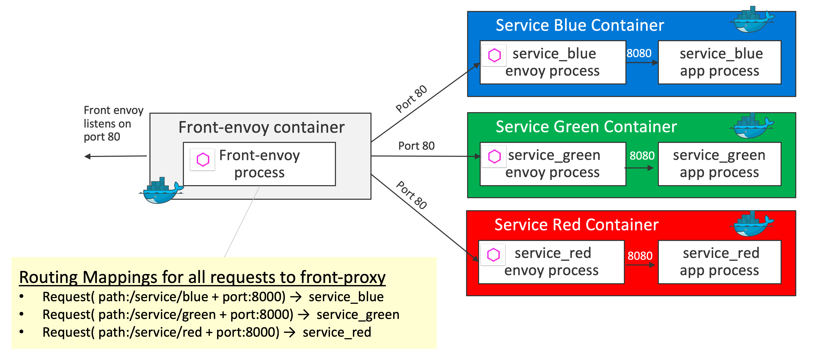

# HTTP Routing: Simple Match Routing

## Demo Overview
All traffic is routed by the `front envoy` to the `service containers`. Internally the traffic is routed to the service envoys, then the service envoys route the request to the flask app via the loopback address. In this demo, all traffic is routed to the service envoys like this:
- A request (path `/service/blue` & port `8000`) is routed to `service_blue` 
- A request (path `/service/green` & port `8000`) is routed to `service_green`
- A request (path `/service/red` & port `8000`) is routed to `service_red`



Key definition 1 - `virtual_hosts` in [front-envoy.yaml](front-envoy.yaml)
```yaml
    virtual_hosts:
    - name: backend
        domains:
        - "*"
        routes:
        - match:
            prefix: "/service/blue"
        route:
            cluster: service_green
        - match:
            prefix: "/service/blue"
        route:
            cluster: service_blue
        - match:
            prefix: "/service/red"
        route:
            cluster: service_red
```

Key definition 2 - `clusters` in [front-envoy.yaml](front-envoy.yaml)
```yaml
  clusters:
  - name: service_blue
    connect_timeout: 0.25s
    type: strict_dns
    lb_policy: round_robin
    http2_protocol_options: {}
    hosts:
    - socket_address:
        address: service_blue
        port_value: 80
  - name: service_green
    connect_timeout: 0.25s
    type: strict_dns
    lb_policy: round_robin
    http2_protocol_options: {}
    hosts:
    - socket_address:
        address: service_green
        port_value: 80
  - name: service_red
    connect_timeout: 0.25s
    type: strict_dns
    lb_policy: round_robin
    http2_protocol_options: {}
    hosts:
    - socket_address:
        address: service_red
        port_value: 80
```

## Getting Started
```sh
$ git clone https://github.com/yokawasa/envoy-proxy-demos.git
$ cd envoy-proxy-demos/httproute-simple-match
```

> [NOTICE] Before you run this demo, make sure that all demo containers in previous demo are stopped!

## Run the Demo

### Build and Run containers

```sh
$ docker-compose up --build -d

# check all services are up
$ docker-compose ps --service

front-envoy
service_blue
service_green
service_red

# List containers
$ docker-compose ps

                 Name                               Command               State                            Ports
-----------------------------------------------------------------------------------------------------------------------------------------
httproute-simple-match_front-envoy_1     /usr/bin/dumb-init -- /bin ...   Up      10000/tcp, 0.0.0.0:8000->80/tcp, 0.0.0.0:8001->8001/tcp
httproute-simple-match_service_blue_1    /bin/sh -c /usr/local/bin/ ...   Up      10000/tcp, 80/tcp
httproute-simple-match_service_green_1   /bin/sh -c /usr/local/bin/ ...   Up      10000/tcp, 80/tcp
httproute-simple-match_service_red_1     /bin/sh -c /usr/local/bin/ ...   Up      10000/tcp, 80/tcp
```

### Access each services

Access serivce_blue and check if blue background page is displayed

```sh
$ open http://localhost:8000/service/blue
# or
$ curl -s -v http://localhost:8000/service/blue
```

Access serivce_gree and check if gree background page is displayed

```sh
$ open http://localhost:8000/service/green
# or
$ curl -s -v http://localhost:8000/service/green
```

Access serivce_red and check if red background page is displayed
```sh
$ open http://localhost:8000/service/green
# or
$ curl -s -v http://localhost:8000/service/red
```

## Stop & Cleanup

```sh
$ docker-compose down --remove-orphans --rmi all
```

---
[Top](../README.md)