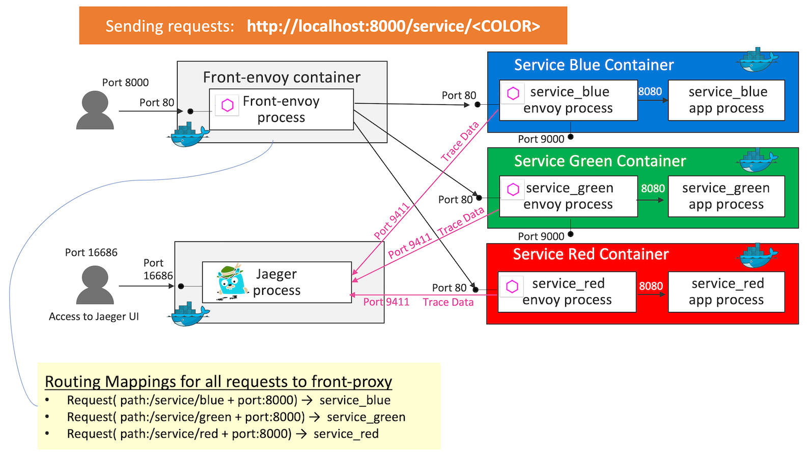
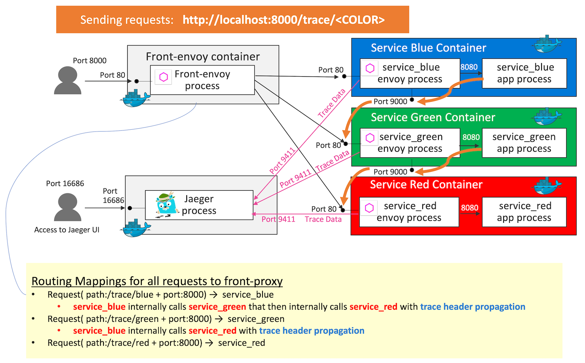
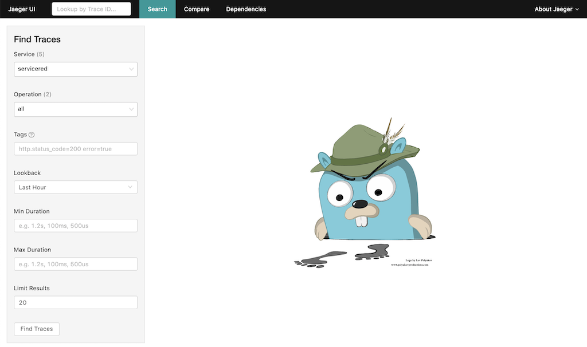
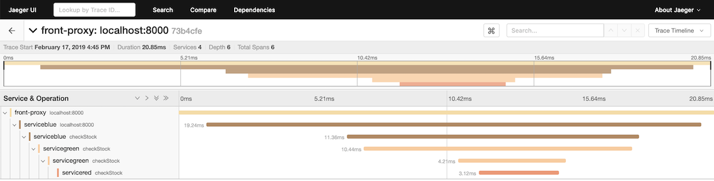
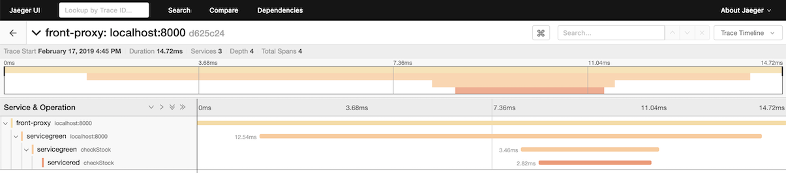
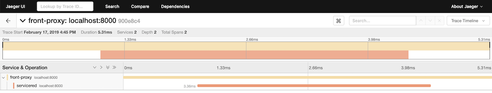

# Distributed Tracing: Jaeger Tracing

## Demo Overview
This is a demo to give an overall picture of how distributed tracing, OpenTracing, Envoy service mesh and Jaeger fit together. All services in the demo support 2 type of endpoints - `service` and `trace` endpoint. All traffic is routed by the `front envoy` to the `service containers`. Internally the traffic is routed to the service envoys, then the service envoys route the request to the flask app via the loopback address. All trace data is collected into a `Jaeger` container.


### Endpoint pattern - service
In `service` endpoint pattern, all traffic is routed to the service envoys like this:
- A request (path `/service/blue` & port `8000`) is routed to `service_blue` 
- A request (path `/service/green` & port `8000`) is routed to `service_green`
- A request (path `/service/red` & port `8000`) is routed to `service_red`



### Endpoint pattern - trace
On the other hand, in `trace` endpoint pattern, all traffic is routed to the service envoys with trace header propagations like this:

- A request (path `/trace/blue` & port `8000`) is routed to `service_blue` 
  - `service_blue` internally calls `service_green` that then internally calls `service_red` with `trace header propagations`
- A request (path `/trace/green` & port `8000`) is routed to `service_green`
  - `service_blue` internally calls `service_red` with `trace header propagations`
- A request (path `/trace/red` & port `8000`) is routed to `service_red`




Key definition 1 - All envoys are configured to collect request traces (e.g., http_connection_manager/config/tracing setup in front envoy).
```
  - filters:
    - name: envoy.http_connection_manager
      config:
        tracing:
          operation_name: egress
```
> - The HTTP connection manager that handles the request must have the tracing object set. Please refer to [tracing object](https://www.envoyproxy.io/docs/envoy/latest/api-v2/config/filter/network/http_connection_manager/v2/http_connection_manager.proto#envoy-api-msg-config-filter-network-http-connection-manager-v2-httpconnectionmanager-tracing).
> - `operation_name`: The span name will be derived from this field (`ingress` or `egress`)
>   - `ingress` (default): ⁣The HTTP listener is used for ingress/incoming requests.
>   - `egress`: The HTTP listener is used for egress/outgoing requests

Key definition 2 - All envoys in the demo are also configured to setup to propagate the spans generated by the Jaeger tracer to a Jaeger cluster. it's trace driver setup

```YAML
static_resources:
...
  clusters:
  ...
  - name: jaeger
    connect_timeout: 1s
    type: strict_dns
    lb_policy: round_robin
    hosts:
    - socket_address:
        address: jaeger
        port_value: 9411
tracing:
  http:
    name: envoy.zipkin
    config:
      collector_cluster: jaeger
      collector_endpoint: "/api/v1/spans"
      shared_span_context: false
```
> Presence of the object defines whether the connection manager emits tracing data to the configured tracing provider. You configure `tracing driver` in `name` field. Here are 4 parameter options for `tracing driver` and `envoy.zipkin` is selected here:
> - envoy.lightstep
> - envoy.zipkin
> - envoy.dynamic.ot
> - envoy.tracers.datadog

> Parameters for Config parts in zipkin deiver are [here](https://www.envoyproxy.io/docs/envoy/latest/api-v2/config/trace/v2/trace.proto#envoy-api-msg-config-trace-v2-zipkinconfig)


Key definition 3 - One of the most important benefits of tracing from Envoy is that it will take care of propagating the traces to the Jaeger service cluster. However, in order to fully take advantage of tracing, the application has to propagate trace headers that Envoy generates. The sample `trace header propagations` setup in servcie application code ([apps/service.py](../apps/service.py)) is this:

```python
# ...omit...

TRACE_HEADERS_TO_PROPAGATE = [
    'X-Ot-Span-Context',
    'X-Request-Id',

    # Zipkin headers
    'X-B3-TraceId',
    'X-B3-SpanId',
    'X-B3-ParentSpanId',
    'X-B3-Sampled',
    'X-B3-Flags',

    # Jaeger header (for native client)
    "uber-trace-id"
]

def render_page():
    return ('<body bgcolor="{}"><span style="color:white;font-size:4em;">\n'
            'Hello from {} (hostname: {} resolvedhostname:{})\n</span></body>\n'.format(
                    os.environ['SERVICE_NAME'],
                    os.environ['SERVICE_NAME'],
                    socket.gethostname(),
                    socket.gethostbyname(socket.gethostname())))

# ...omit...

@app.route('/trace/<service_color>')
def trace(service_color):
    headers = {}
    ## For Propagation test ##
    # Call service 'green' from service 'blue'
    if (os.environ['SERVICE_NAME']) == 'blue':
        for header in TRACE_HEADERS_TO_PROPAGATE:
            if header in request.headers:
                headers[header] = request.headers[header]
        ret = requests.get("http://localhost:9000/trace/green", headers=headers)
    # Call service 'red' from service 'green'
    elif (os.environ['SERVICE_NAME']) == 'green':
        for header in TRACE_HEADERS_TO_PROPAGATE:
            if header in request.headers:
                headers[header] = request.headers[header]
        ret = requests.get("http://localhost:9000/trace/red", headers=headers)
    return render_page()

if __name__ == "__main__":
    app.run(host='127.0.0.1', port=8080, debug=True)
```

>  **Zipkin tracer**
- When using the `Zipkin tracer`, Envoy relies on the service to propagate the `B3 HTTP headers` ( `x-b3-traceid, x-b3-spanid, x-b3-parentspanid, x-b3-sampled, and x-b3-flags`). The x-b3-sampled header can also be supplied by an external client to either enable or disable tracing for a particular request. In addition, the single b3 header propagation format is supported, which is a more compressed format. Please refer to [B3 Header](https://www.envoyproxy.io/docs/envoy/latest/configuration/http_conn_man/headers#config-http-conn-man-headers-b3) for the detail. 


## Getting Started
```sh
$ git clone https://github.com/yokawasa/envoy-proxy-demos.git
$ cd envoy-proxy-demos/jaeger-tracing
```
> [NOTICE] Before you run this demo, make sure that all demo containers in previous demo are stopped!

## Run the Demo

### Build and Run containers

```sh
$ docker-compose up --build -d

# check all services are up
$ docker-compose ps --service

front-envoy
service_blue
service_green
service_red
jaeger

# List containers
$ docker-compose ps

             Name                           Command               State                                                   Ports
-------------------------------------------------------------------------------------------------------------------------------------------------------------------------------
jaeger-tracing_front-envoy_1     /usr/bin/dumb-init -- /bin ...   Up      10000/tcp, 0.0.0.0:8000->80/tcp, 0.0.0.0:8001->8001/tcp
jaeger-tracing_jaeger_1          /go/bin/all-in-one-linux - ...   Up      14250/tcp, 14268/tcp, 0.0.0.0:16686->16686/tcp, 5775/udp, 5778/tcp, 6831/udp, 6832/udp,
                                                                          0.0.0.0:9411->9411/tcp
jaeger-tracing_service_blue_1    /bin/sh -c /usr/local/bin/ ...   Up      10000/tcp, 80/tcp
jaeger-tracing_service_green_1   /bin/sh -c /usr/local/bin/ ...   Up      10000/tcp, 80/tcp
jaeger-tracing_service_red_1     /bin/sh -c /usr/local/bin/ ...   Up      10000/tcp, 80/tcp
```

### Access each services

Access serivce_blue and check if blue background page is displayed

```sh
$ open http://localhost:8000/service/blue
# or
$ curl -s -v http://localhost:8000/service/blue
```

Access serivce_gree and check if gree background page is displayed

```sh
$ open http://localhost:8000/service/green
# or
$ curl -s -v http://localhost:8000/service/green
```

Access serivce_red and check if red background page is displayed
```sh
$ open http://localhost:8000/service/green
# or
$ curl -s -v http://localhost:8000/service/red
```

### Test tracing

Access the following 3 endpoints for tracing test.
```
$ curl -s -v http://localhost:8000/trace/blue
$ curl -s -v http://localhost:8000/trace/green
$ curl -s -v http://localhost:8000/trace/red
```

Actually trace data would automatically have been generated and pushed to Jaeger via Envoy. Then check the Jaeger UI to ses how the Jaeger visualize all the trace data collected. Here is a Jaeger UI url:

```
$ open http://localhost:16686
```



You'll come up with Jager UI, then search each traces. Here are example trace results:







## Stop & Cleanup

```sh
$ docker-compose down --remove-orphans --rmi all
```

---
[Top](../README.md)