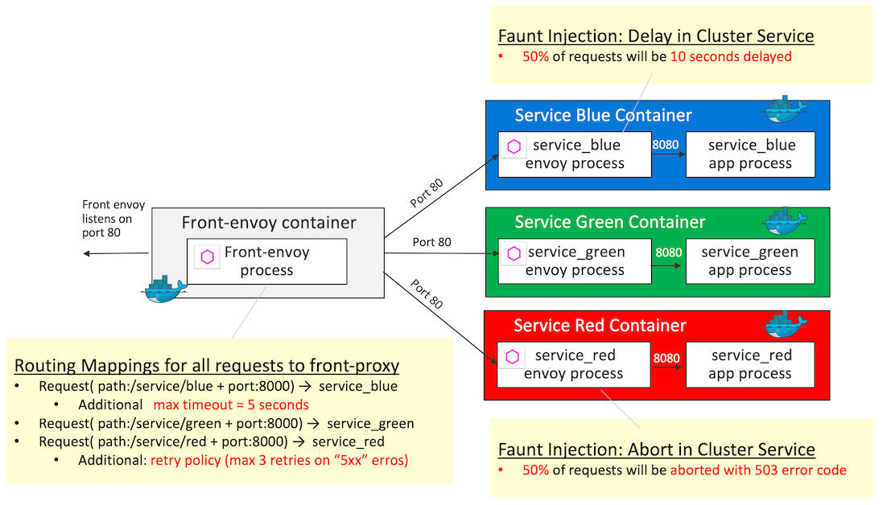

# Timeouts and Retries

## Demo Overview



Front-proxy configurations are the same as the ones in [HTTP Routing: Simple Match Routing](../httproute-simple-match). Differences from [HTTP Routing: Simple Match Routing](../httproute-simple-match) are the following 2 additional behaviors:
- `Timeouts` (5 seconds) for the request to `service_blue`
- `Retries` that Envoy will attempt to do if `service_red` responds with any 5xx response code

For Service Containers, `delay` fault injection and `abort` fault injection are configured in `service_blue` and `service_red` respectively (which are the same configuration as the ones in [Fault Injection Demo](../fault-injection))

Key definition - `virtual_hosts` in [front-envoy.yaml](front-envoy.yaml)
```yaml
    virtual_hosts:
    - name: backend
        domains:
        - "*"
        routes:
        - match:
            prefix: "/service/blue"
        route:
            cluster: service_blue
            timeout: 5s
        - match:
            prefix: "/service/green"
        route:
            cluster: service_green
        - match:
            prefix: "/service/red"
        route:
            cluster: service_red
            retry_policy:
            retry_on: "5xx"
            num_retries: 3
            per_try_timeout: 5s
```
> - `timeout`:  (Duration) Specifies the timeout for the route. If not specified, the default is 15s. For more detail, see `timeout` section in [RouteAction](https://www.envoyproxy.io/docs/envoy/v1.5.0/api-v2/rds.proto#routeaction)
> - `retry_policy` indicates the retry policy for all routes in this virtual host. For more detail on retry_policy, see [route.RetryPolicy](https://www.envoyproxy.io/docs/envoy/latest/api-v2/api/v2/route/route.proto.html#envoy-api-msg-route-retrypolicy)

## Getting Started
```sh
git clone https://github.com/yokawasa/envoy-proxy-demos.git
cd envoy-proxy-demos/timeouts-retries
```
> [NOTICE] Before you run this demo, make sure that all demo containers in previous demo are stopped!

## Run the Demo

### Build and Run containers

```sh
$ docker-compose up --build -d

# check all services are up
$ docker-compose ps --service

front-envoy
service_blue
service_green
service_red

# List containers
$ docker-compose ps

              Name                            Command               State                            Ports
-----------------------------------------------------------------------------------------------------------------------------------
timeouts-retries_front-envoy_1     /usr/bin/dumb-init -- /bin ...   Up      10000/tcp, 0.0.0.0:8000->80/tcp, 0.0.0.0:8001->8001/tcp
timeouts-retries_service_blue_1    /bin/sh -c /usr/local/bin/ ...   Up      10000/tcp, 80/tcp
timeouts-retries_service_green_1   /bin/sh -c /usr/local/bin/ ...   Up      10000/tcp, 80/tcp
timeouts-retries_service_red_1     /bin/sh -c /usr/local/bin/ ...   Up      10000/tcp, 80/tcp
```

### Access each services

Access serivce_blue and check if 50% of requests to service_blue are timeout error (over 5 seconds timeout error with 504 status code). The following helper command allow you to send requests repeatedly (For example, send 10 requests to http://localhost:8000/service/blue).

```sh
$ ../helpers/send-requests.sh http://localhost:8000/service/blue 10

Sending GET request: http://localhost:8000/service/blue
504
Sending GET request: http://localhost:8000/service/blue
504
Sending GET request: http://localhost:8000/service/blue
504
Sending GET request: http://localhost:8000/service/blue
200
Sending GET request: http://localhost:8000/service/blue
200
```

Access serivce_blue and check if green background page is displayed. It is expected that nothting special will occur

```sh
$ curl -s http://localhost:8000/service/green
```

Access serivce_red and check if most of requests to service_red are ok (200 status code), but seldomly you'll get abort error (503 status code). To explain what happens behind the senene, 50% of requests to  `service_red` will be aborted with 503 error code due to the fault injection config in service_red, however the request will be recovered by the front proxy's retry mechanism, which is why most of the requests to service_red tuned out to be ok (200 status code). The following helper command allow you to send requests repeatedly (For example, send 10 requests to http://localhost:8000/service/blue)

```sh
$ ../helpers/send-requests.sh http://localhost:8000/service/red 10

Sending GET request: http://localhost:8000/service/red
200
Sending GET request: http://localhost:8000/service/red
200
Sending GET request: http://localhost:8000/service/red
200
Sending GET request: http://localhost:8000/service/red
200
Sending GET request: http://localhost:8000/service/red
200
Sending GET request: http://localhost:8000/service/red
200
Sending GET request: http://localhost:8000/service/red
200
Sending GET request: http://localhost:8000/service/red
503
Sending GET request: http://localhost:8000/service/red
200
Sending GET request: http://localhost:8000/service/red
200
```

## Stop & Cleanup

```sh
$ docker-compose down --remove-orphans --rmi all
```

---
[Top](../README.md)